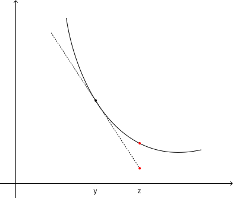

# Richiami

I versori canonici di $R^n$ sono n vettori del tipo:

$$
\hat e_k = (0, ..., 1, ..., 0)
$$

ovvero vettori che hanno 1 nella k-esima posizione e zero nelle altre. Il cappello indica che sono versori, ovvero la
loro norma è unitaria.

Vengono utilizzati per la cosiddetta _one-hot encoding_ delle label.

## Norma

La norma è un'operazione scalare $|•|: R^n \to R$ che introduce il concetto di distanza. Sui numeri reali abbiamo un
ordinamento indotto.

Ritorna nell'overfitting: voglio sì imaprare dal dataset (bias) ma mantenere una generalità per poter fare predizioni
su un dataset ignoto. Il problema è che se divento troppo bravo per fittare sugli elementi del trainset, vado a
overfittare. Ci sono degli elementi di regolarizzazione per evitare overfitting.

Il modulo definisce la distanza dall'origine, e in generale si può definire una distanza tra vettori:

$$
| v - w | = \sqrt{\sum_{i=0}^n (x_i - y_i)^2}
$$

Spesso chiamiamo distanza anche ciò che distanza non è: ci sono misure di similarità come la cosine similarity che
vengono chiamate distanze.

Tra le proprietà del modulo citiamo nuovamente la disuguaglianza triangolare, molto importante:

$$
| v_1 + v_2 | \le | v_1 | + | v_2 |
$$

Pensiamo invece alla cosine similarity, non vale più la disuagualianza triangolare, quindi è sbagliato definirla distanza.

## Prodotto scalare

Il prodotto scalare tra due vettori associa a una coppia di vettori v e w, uno scalare $<v, w>$ oppure $v \cdot w$:

$$
\cdot : R^n \times R^n \to R \\
\langle v, w \rangle = v \cdot w = \sum_{i=1}^n x_i y_i
$$

in inglese si chiama dot product. Si contrappone al prodotto element-wise che si indica con un punto cerchiato.

Proprietà:

$$
\langle v, w \rangle = |v| \cdot |w| \cdot \cos (\theta)
$$

Da qui deduciamo che presi due vettori non nulli, allora $\langle v, w \rangle = 0 \Leftrightarrow v, w \ \text{ortogonali}$.

Vale la disuguaglianza di Cauchy-Schwarz, cioè:

$$
\langle v, w \rangle \le |v| \cdot |w|
$$

Per completezza definiamo anche il prodotto vettoriale, che individua il vettore ortogonale all'iperpiano su cui giacciono i vettori.
Non è sempre possibile definirlo.

## Derivate

Partiamo generalizzando il concetto di derivata per $R^n$.

> Varietà affine: dato un vettore $s \in \mathbb R^n$, si dice **varietà affine** di $\mathbb R^n$ passante per $x_0 \in \mathbb R^n$ la traslazione
> del sottospazio generato da $s \in x_0$.
> $$
x(\alpha) = x_0 + \alpha s, \ \alpha \in \mathbb R
$$

Definiamo quindi la derivata direzionale di una funzione $f: \mathbb R^n \to \mathbb R$ rispetto alla direzione di s in
$x_0$ il seguente limite:

$$
d_sf = \lim_{\alpha \to 0^+} \frac{f(x_0 +\alpha s) - f(x_0)}{\alpha}
$$

Se tale limite esiste finito, la funzione f ha derivata direzionale rispetto a s.

La derivata direzionale rispetto ai versori canonici permette di ricavare le derivate direzionali.
Il vettore delle operazioni di derivate direzionali si chiama nabla e si indica come:

$$
\nabla = \begin{pmatrix} \delta \over \delta x_{1} \\ ... \\ \delta \over \delta x_{3} \end{pmatrix}
$$

moltplicando col prodotto vettoriale per una funzione otteniamo le sue derivate parziali.

Il vettore delle derivate parziali si chiama 

## Hessiano

Se $f \in \mathcal C ^ 2 (\mathbb R^n)$ allora è possibile differenziare ogni derivata parziale rispetto a ogni versore
canonico, otteniamo quindi la matrice hessiana, ovvero delle derivate parziali miste.

Dal teorema di Schwarz tale matrice è simmetrica. Ovvero se le derivate secondo miste sono continue, allora è ininfluente
l'ordine con cui si fanno le derivate parziali.

$$
\nabla^2 f = H =
\begin{bmatrix} 
\frac{\partial^2 f}{\partial x_1^2} & \frac{\partial^2 f}{\partial x_1 \partial x_2} & \cdots & \frac{\partial^2 f}{\partial x_1 \partial x_n} \\
\frac{\partial^2 f}{\partial x_2 \partial x_1} & \frac{\partial^2 f}{\partial x_2^2} & \cdots & \frac{\partial^2 f}{\partial x_2 \partial x_n} \\
\vdots & \vdots & \ddots & \vdots \\
\frac{\partial^2 f}{\partial x_n \partial x_1} & \frac{\partial^2 f}{\partial x_n \partial x_2} & \cdots & \frac{\partial^2 f}{\partial x_n^2}
\end{bmatrix}
$$

In un contesto di SVM o regression $\mathbb R^n$ è lo spazio del dataset, mentre in deep learning è lo spazio dei parametri.

L'Hessiana viene utilizzati nei metodi c.d. del secondo ordine.

## Jacobiano

Matrice rettangolare $n \cdot m$, e si definisce come:

$$
\nabla f(x) = (\nabla f_1(x) \ \dots \ \nabla f_1(x))
$$

serve a fare back-propagation.

Regola pratica per il calcolo della derivata direzionale: TODO

Le funzioni quadratiche sono le funzioni quadratiche. Le usiamo perché sono funzioni di tipo loss e voglio individuare dei
minimi. Lo uso nell'ottimizzazione.

La variazione è il gradiente, l'hessiana è la curvatura. Analogamente in $\mathbb R$ la concavità è data dalla derivata seconda.

### Rosenbrock

Sia data la funzione $f : \mathbb R^2 \to \mathbb R$

$$
f(x) = 100(x_2 - x_1^2)^2 + (1-x_1)^2
$$

## Curve e insiemi di livello

Una curva di livello associata a una funzione $f(x)$ è l'insieme dei punti:

$$
\{ x \in \mathbb R^n: f(x) = c\}
$$

mentre gli insiemi di livello si ottengono con una disuguaglianza rispetto a c.

Il gradiente è ortogonale alla tangente della curva di livello. Questo fatto è utile per interpretare il metodo di discesa
del gradiente.

$$
+- {\nabla f(x_0) \over || \nabla f(x_0) ||}
$$

sono i due versori ortogonali alla curva di livello. Sono le direzioni di massima crescita e decrescita della funzione.

$$
{\delta f(x_0) \over \delta \alpha} = \nabla f(x_0)^T s = || \nabla f(x_0) ||\ ||s||\ \cos(\phi)
$$

Quand'è che questo prodotto scalare diventa massimo o minimo? Questo succede quando la direzione è quella del gradiente
o dell'antigradiente, ovvero per quei $\phi$ tali che il coseno abbia valori 1 e -1.

$\cos(\phi)$ è funzione dell'angolo tra i due vettori del prodotto scalare, ovvero la direzione s e il gradiente.

Per funzioni lineari (ovvero del tipo $\mathcal l(x) = a^Tx + b$), con gli a e b costanti, vale la regola di derivazione
del prodotto:

$$
\nabla (u^T v) = (\nabla u^T) v + (\nabla v^T) u
$$

queste saranno le prime funzioni di learning che andremo a realizzare. L'Hessiano delle funzioni lineari è sempre 0.

Le forme quadratiche compaiono spesso anche come approssimazione di funzioni più complicate. Se conosco il comportamento
di un modello per una funzione quadratica ho anche informazioni su come si comporta il modello in generale.

$$
q(x) = {1 \over 2} x^T Q x + b^Tx + c
$$

con Q matrice simmetrica di ordine n ($b \in \mathbb R^N$ e $c \in \mathbb R$ costanti).

Il gradiente delle forme quadratiche è $\nabla q(x) = Qx + b$.

Un esempio di applicazione è il problema dei minimi quadrati. Immaginiamo di voler approssimare un insieme di m punti
con un polinomio di grado n $P_n(x) = a_0 + a_1x + \dots + a_n x^n$.
L'obiettivo è individuare una curva che approssimi bene la funzione.

Risolviamo:

$$
\min_{a\in \mathbb R^{n+1}} ||E||^2
$$

con

$$
E = y - Va
$$

dove V rappresenta la matrice di Vandermonde (che si ottiene per ogni riga i, con le potenze da 0 a n del punto $x^i$).

Ricordiamoci che $P_n(x) = Va$, quindi $E = y - P_n(x)$

La forma quadratica dove si trova? Riscriviamo la funzione obiettivo da minimizzare, ovvero

$$
||E||^2 = E^T E
$$

1. Scriviamo gli scarti per esteso:

    $$
    y_1 - a_0 + a_1x_1 + \dots a_n x_1^n \\
    y_2 - a_0 + a_1x_2 + \dots a_n x_2^n \\
    \vdots \\
    y_m - a_0 + a_1x_nm+ \dots a_n x_m^n \\
    $$

2. Quelle espressioni si possono riscrivere in forma matriciale

    $$
    y = \begin{pmatrix} y_{1} \\ \vdots \\ y_{m} \end{pmatrix} \\
    a = \begin{pmatrix} a_0 \\ a_{1} \\ \vdots \\ y_{n} \end{pmatrix} \\
    $$

3. Riscrivo il problema di minimi quadrati

    in funzione degli scarti $s_i$

    $$
    \min_{a \in \mathbb R^{n+1}} \sum_{i=1}^m s_i^2 = \min_{a \in \mathbb R^{n+1}} ||S||^2 = \min_{a \in \mathbb R^{n+1}} S^TS = \min_{a \in \mathbb R^{n+1}} (y-Va)^t(y-Va)
    $$

    so fare il prodotto scalare quindi ottengo

    $$
    \min_{a \in \mathbb R^{n+1}} y^Ty + a^TV^TVa - 2y^TVa
    $$

    e chiamiamo $Q=V^TV$, $b=y^TV=V^Ty$, $c=y^Ty$.

Le support vector machine richiedono di risolvere problemi quadratici: per ottenere i pesi delle SVM si devono risolvere
problemi di questa natura.

## Formula di Taylor

Per una funzione reale sufficientemente regolare (ovvero di classe $C^{p-1}$), è possibile dare la formula di Taylor che
approssima al p-esimo ordine.

Per una direzione di spostamento rappresentata dalla restrizione $f(x(\alpha))$, che permette di descrivere f come se
fosse una funzione di una sola variabile.

Scrivo a questo punto la formula di Taylor al secondo ordine per la restrizione di f lungo di direzione di $\alpha$.

Quando $\alpha$ è molto piccolo, il resto della formula di Taylor secondo Peano è un o-piccolo di $\alpha$.

## Insiemi convessi

> Un insieme è convesso se comunque presi due punti all'interno dell'insieme, il segmento che li congiunge è completamente
contenuto nell'insieme.

Matematicamente è come chiedere che $\alpha x + (1-\alpha)y \in \Omega\  \forall \ \alpha \in [0,1]$.

Un esempio è la boccia di raggio 1 centrata nell'origine: $\{ \bold x \in \mathbb R^n : ||x|| \le 1\}$

Se dovessi lavorare con insieme non convessi avrei il problema di stare attento a non uscire dal dominio dela funzione
(l'insieme convesso). Questa osservazione è importante quando compiamo spostamenti iterativi in $\mathbb R^n$,
percorrendo delle direzioni date da dei segmenti, di non uscire dal dominio.

Sugli insieme convessi definiamo funzioni convesse, ovvero che possiedono tale proprietà:

$$
f(\alpha x + (1-\alpha)y) \le \alpha f(x) - (1- \alpha) f(y) \ \forall \alpha \in [0, 1]
$$

$\alpha x + (1-\alpha)y$ è una combinazione convessa di x e y, che mi porta su un segmento di estremi x e y.

Sostanzialmente chiediamo che l'arco di curva sotteso dal segmento che rappresenta la combinazione convessa
$\alpha x + (1-\alpha)y$ abbia un valore inferiore alla combinazione convessa stessa.

Quando al disuguaglianza è stretta, la funzione è **perfettamente convessa**.
La funzione è convessa se e solo se esiste l'epigrafico di f.

### Proprietà

Data una funzione $f: \Omega \to \mathbb R$ di classe $C^1$ definita su un insieme convesso allora:

$f$ è una funzione convessa su $\Omega$ se e solo se per ogni coppia di punti z, y di omega:

$$
f(z) \ge f(y) + \nabla f(y)^T (z-y)
$$

il right hand side è lo sviluppo di Taylor della funzione f troncato al primo ordine.

Se tale disuguaglianza è stretta, la funzione è strettamente convessa.

Se la funzione è di classe $C^2$ allora $f$ è convessa su omega se e solo se $\nabla^2 f(x)$ è semidefinita positiva per ogni $x \in \Omega$

$$
x^T Ax \ge 0 \ \forall x \in \mathbb R^n
$$

Questa condizione è equivalente alla convessità.

Analogamente se l'hessiano è definito positivo, allora la funzione è strettamente convessa. Attenzione che questa implicazione
è one-way, infatti non vale sempre il viceversa.

La funzione può quindi essere strettamente convessa e l'heassiano è definito positivo.
