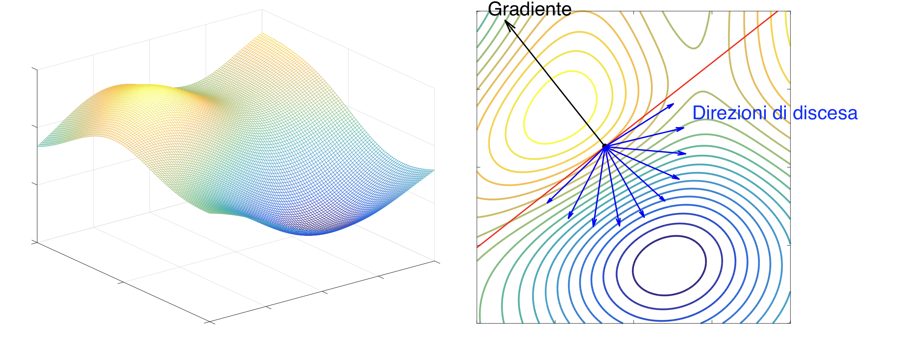

# Metodi basati sul gradiente

Il framework è un problema di classificazione binaria. Abbiamo un training set che è l'insieme delle coppie $(a_i, b_i)$
con label binarie che possono assumere i valori 1 e -1.

L'obiettivo di un algoritmo di machine learning è determinare i pesi w e c della combinazione lineare .

Un possibile modo per evitare l'overfitting è aggiungere un termine ${\lambda \over 2} ||f_{w,c}||^2$ che limiti la
complessità della funzione.

$V(b, f)$ è la funzione di loss. Se scegliamo la funzione logistica:

$$
V(b, f_{w,c}(a)) = log(1+e^{-bf(a)}) = log(1 + e^{-b(w^Ta+c)})
$$

Questa funzione mi dice che se la quantità $(w^Ta+c)$ è negativa, sto commettendo un errore sul trainset e la funzione
la quantifica facendo salire rapidamente la funzione, visto che l'esponente è cambiato di segno.

Per tenere bassa la complessità della funzione, prendiamo come misura la norma 2 del vettore

$$
\begin{pmatrix} w\\c\\ \end{pmatrix}
$$

Ci sono delle complicazioni numeriche date dalla dimensione (larghezza) del singolo dato del tranining set e anche
dalla dimensione totale del set. In questo caso potremmo avere un numero w di pesi uguale alla dimensione di un'immagine
se stiamo lavorando con delle immagini.

## Problemi non vincolati

I problemi di ottimizzazione che trattiamo sono problemi di ottimizzazione **non vincolata**. Si indica in letteratura
con NLP (non-linear programming). La funzione obiettivo deve essere differenziabile.

$$
\min_{x \in \mathbb R^n} f(x) \\
f : \mathbb R^n \to \mathbb R, f \in \mathcal C^1(\mathbb R^n)
$$

differenziabile con continuità in $\mathbb R^n$.

I metodi della soluzione sono iterativi (costruiamo una successione partendo da un punto iniziale $x^{(0)}$) che sotto
opportune condizione tende a $x^*$ soluzione del problema.

$$
{x^{(k)} \to x^*}
$$

Non è un metodo di soluzione esatto, stai maneggiando un metodo di approssimazione. Bisogna stabilire le condizioni di
stop per stabilire quando fermare la convergenza della successione.

In molte applicazioni ci si accontenta di una buona approssimazione. Non servono soluzioni esatte.

- Come costruisco la successione $\{x^{(k)}\}$?

- La successione va a convergenza? $x^{(k)} \to_{k \to \infty} x^*$

- Affrontare l'aspetto pratico del criterio d'arresto. Il limite ha senso, ma dal lato pratico quando devo troncare la successione?

L'obiettivo è avvicinarsi al punto di minimo, l'idea alla base dei metodi del gradiente è passare dal passo k al k+1
riducendo il valore della funzione obiettivo.

$$
f(x^{(k+1)}) \lt f(x^{(k)}), \ k=0, 1, \dots
$$

in tal senso il metodo è di **discesa** perché costruiscono successioni basate su questa idea.

## Costruire le successioni

$$
x^{(k+1)} = x^{(k)} + \alpha_k d^{(k)}, \ k=0, 1, \dots
$$

Correggiamo l'iterata corrente con una formula additiva che richiede due elementi:

- un parametro reale positivo $\alpha_k$ detto _steplength_;

- una direzione $d^{(k)}$ che è un vettore di $\mathbb R^n$.

La formula è banale.

Per garantire la discesa devo scegliere un vettore d tale che:

$$
\nabla f(x)^T d \lt 0
$$

Se il vettore d soddisfa la condizione, viene detto direzione di discesa per il punto $x^{(k)}$.

Questo mi garantisce che fare un passo lungo la direzione d, mi fa ridurre la funzione obiettivo e soddisfa quindi la
condizione di base che $f(x + \alpha d) \lt f(x)$.

Se x non è un punto stazionario, allora e solo allora esiste la direzione di discesa. Se essa non esiste, x è punto stazionario.
Ovvero il gradiente di un punto stazionario è nullo.

Una direzione di spostamento è sempre garantita: spostamento lungo l'antigradiente:

$$
d = - \nabla f(x) \\
\nabla f(x) d = -||\nabla f(x)||^2 \lt 0
$$

Gli algoritmi possono anche fare scelte di calcolo più sofisticate. Costa molto poco.

Dimostrazione del punto stazionario:

supponiamo che $\nabla f(x)^T d \ge 0 \ \forall d \in \mathbb R^n$, fissato d, la disuguaglianza vale sia per d che per
-d. Ma allora $\nabla f(x) = 0$.

Per evitare overshooting, dobbiamo regolare la lunghezza del passo iterativo. Siamo sicuri, dalle precedenti condizioni,
che lo schema sia ben posto.

L'ampia diffusione di questi schemi è la facilità con cui si possono implementare.

## Fermarsi

A livello pratico non si controlla che il gradiente sia uguale a 0, ma bisogna avere una sensibilità numerica e interrompere
il metodo se la norma del gradiente è abbastanza vicino a zero, cioè minore di un certo $\tau$ arbitrariament epiccolo.
Il valore dipende anche dalla correttezza richiesta al problema. Se la soluzione deve avere tre cifre dopo la virgola,
imposto una tollerenza di $10^{-4}$.

Tengo conto sia dell'accuratezza che voglio raggiungere che del fatto che la macchina lavora in modo approssimato.

Il criterio di arresto **naturale** è appunto quello del gradiente, ma possiamo considerare anche la distanza realtiva
tra le iterate:

$$
\frac{||x^{(k+1)} - x^{(k)}||}{||x^{(k)}||} \le \tau
$$

oppure come differenza relativa tra i valori della funzione obiettivo:

$$
\frac{f(x^{(k+1)}) - f(x^{(k)})}{f(x^{(k)})} \le \tau
$$

## Dettagli

Per scegliere la direzione di spostamento, indicata in letteratura come: $d^{(k)} = - D_k \nabla f(x^{(k)})$. La formula
è basata sull'antigradiente. Per verificare che una direzione sia di discesa devo fare un controllo del tipo:

$D_k$ simmetrica definita positiva, sono sicuro di prendere direzioni di discesa:

$$
\nabla f(x^{(k)}) d^{(k)} = - \nabla f(x^{(k)}) D_k \nabla f(x^{(k)})
$$

In base alla scelta dei vari $D_k$ corrispondono i vari metodi di discesa del gradiente:

- $D_k = I$ che dà luogo al metodo di _steepest descent_, ovvero discesa ripida. Scegliendo la matrice identità percorri
in discesa l'antigradiente.

    Si chiama così perché per ogni spostamento mi sto muovendo nella direzione di massima pendenza rispetto alla funzione.

    A volte questa scelta porta a convergenza lenta, nonostante sia di estrema semplicità. Verrà usata in problemi di
    grandi dimensioni. Filone di ricerca attuale: schemi che convergono velocemente anche con questa direzione di discesa.

- $D_k = \nabla^2 f(x^{(k)})^{-1}$ è il metodo di Newton. Questo schema è più complesso ma il più veloce: richiede l'hessiano
quindi le derivate seconde. E poi calcolare una matrice inversa.

    L'idea è, a ogni passo, di approssimare la funzione con la formula di Taylor al secondo ordine.

    Il minimo globale della forma quadratica della formula di Taylor, si ottiene ponendo l'hessiana a 0.

    Quindi il metodo di Newton minimizza l'approssimazione quadratica della funzione.

    $$
    \nabla^2 f(x^{(k)}) z = - \nabla f(x^{(k)}) \\
    Ax = b
    $$

    z è una direzione di discesa. Ma è come risolvere un sistema di equazioni lineari a ogni passo.

    Il secondo ordine utilizza in qualche modo la curvatura delal funzione e si traduce in una convergenza più veloce.
    Con migliaia di variabili, i costi sono talmente alti che non ne vale la pena.

- Simulazione di Newton con matrice diagonale, quindi calcoli le derivate seconde sulla diagonale e prendi quelle.
Complessità inferiore a Newton ma superiore allo steepest descent: **steepest descent scalato diagonalmente**.

- Metodo di Newton modificato: calcolo l'hessiano solo ogni $m$ iterazioni.

- Metodi di quasi-Newton: la matrice $D_k$ viene scelta imponendo le condizioni delle secanti. $D_k = B_k^{-1}$.
La derivata prima è approssimata da un rapporto incrementale.

    Formule esplicite per calcolare le successive matrici $B_k$ con i metodi BFGS.
